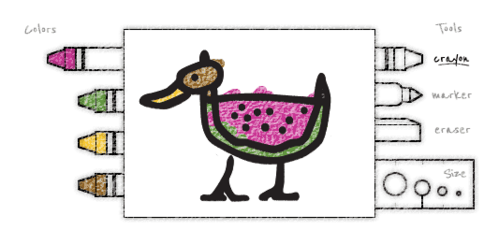

# **Project name:** Doodlelli

# **Concept:** 

A simple drawing app for kids

# ***Observation:***

1. The drawing apps lack fun in visual interface

2. There’s no sound when the pen is drawing to the canvas

3. There usually is no animation effect which kids love

# **MVP features:** 

1. **Simplicity and fun**

	Straightforward interface, minimum text, geometric shapes

2. **Vibrant colors**

	Bright colors and texture that evokes sense of fun

3. **Animation and sound**

	Loading animation and sound to add a funky flair